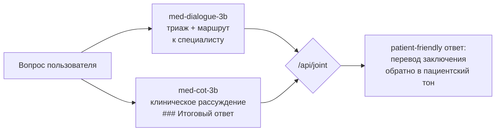

# Med Assistant on Qwen2.5-3B · два full fine-tune + joint-пайплайн

> **EN.** Two independently fine-tuned Qwen2.5-3B-Instruct models for a medical
> assistant: patient triage & doctor routing, and chain-of-thought clinical
> reasoning — served together behind one FastAPI endpoint, with a reproducible
> benchmark harness (base vs fine-tuned vs pipelines). Solo project, trained
> locally on a single RTX 3090.

Две **полностью независимые** модели, обученные полным файнтюном от общей базы
`Qwen2.5-3B-Instruct/`, плюс API-сервер для их раздельного и совместного использования.

## Результаты в двух таблицах

Полный файнтюн даёт прирост против базовой модели на всех ключевых метриках:

| Метрика (test-сплиты датасетов) | Base Qwen2.5-3B | Fine-tuned |
|---|---|---|
| Routing accuracy (модель №1) | 0.00 | **0.48**, joint-пайплайн — **0.64** |
| Диалоговый ответ, ROUGE-L (модель №1) | 0.142 | **0.294** (+107%) |
| Клинический итог, final-F1 (модель №2) | 0.223 | **0.329** (+47%) |
| CoT-формат ответа («Рассуждение → Итог») | 0.00 | **1.00** |
| Safety violations (запрещённые советы) | — | **0** у всех участников |

Внешний бенчмарк (не датасетные вопросы): routing **0.667**, fact recall
0.55–0.57 у одиночных моделей. DPO-этап для CoT-модели проверен отдельно —
прибыли не дал и **в продакшн не рекомендуется** (решение по метрикам, не по вкусу).

Подробные таблицы: `runs/benchmark_report_ext6.md`, `runs/benchmark_ds_report.md`,
`REPORT.md`.

| Модель | Датасет | Назначение |
|---|---|---|
| `models/med-dialogue-3b` | [Mykes/rus_med_dialogues](https://huggingface.co/datasets/Mykes/rus_med_dialogues) (2 863 train / 151 val / 335 test) | пациентский триаж: возможные причины симптомов, маршрут к специалисту |
| `models/med-cot-3b` | [Mykes/medical_cot_rus](https://huggingface.co/datasets/Mykes/medical_cot_rus) (5 901 / 188 / 188) | клинические рассуждения: «### Рассуждение … ### Итоговый ответ» |

Железо, на котором проект рассчитан работать: 1× RTX 3090 24 ГБ, Python 3.12, venv `.venv`.

## Как это работает



- `/api/dialogue` — пациент спрашивает по-простому, модель называет вероятные
  причины и специалиста;
- `/api/cot` — клинический вопрос, модель рассуждает шагами и выдаёт итог;
- `/api/joint` — конвейер №1 → №2 → №1: рассуждение «врачом» скрыто от пациента.

## Быстрый старт

```bash
# 1. Окружение
python3.12 -m venv .venv && .venv/bin/pip install -r requirements.txt

# 2. Самотест движка: unsloth full FT, 1 микрошаг (~2 мин, ~20 ГБ VRAM)
.venv/bin/python scripts/check_engine.py        # ждём строку "ENGINE OK"

# 3. Обучение (модели независимы, №2 — после №1)
.venv/bin/python scripts/train.py --preset dialogues
.venv/bin/python scripts/train.py --preset cot

# 4. Оценка и сервер (обе модели в памяти, ~12,4 ГБ VRAM)
.venv/bin/python scripts/evaluate.py --model models/med-dialogue-3b --preset dialogues
.venv/bin/uvicorn inference.server:app --host 127.0.0.1 --port 8000
```

```bash
curl -s -X POST 127.0.0.1:8000/api/joint -H 'Content-Type: application/json' \
  -d '{"question": "Мучает изжога по ночам, что делать?"}'
```

Swagger UI: <http://127.0.0.1:8000/docs>.

## Структура

```
Qwen2.5-3B-Instruct/              # общая база (не изменяется)
scripts/prepare_data.py           # датасеты -> data/*.jsonl (все колонки, train/val/test)
scripts/check_engine.py           # самотест движка обучения (unsloth full FT)
scripts/train.py                  # полный SFT-файнтюн (unsloth | transformers)
scripts/train_dpo.py              # опциональный LoRA-DPO + слияние (CoT-модель)
scripts/evaluate.py               # test loss + примеры генераций
scripts/benchmark.py              # внешний бенчмарк: base vs fine-tuned vs пайплайны
scripts/benchmark_ds.py           # бенчмарк на test-сплитах датасетов
inference/server.py               # FastAPI: /api/dialogue, /api/cot, /api/joint, /api/health
inference/client.py               # CLI-клиент сервера
data/                             # подготовленные выборки + cot_dpo_reserved.jsonl
runs/                             # логи обучения, отчёты оценки и бенчмарков
models/med-dialogue-3b/           # полная модель №1
models/med-cot-3b/                # полная модель №2
```

## Полный пайплайн (команды из корня проекта)

```bash
# 0. Самотест движка
.venv/bin/python scripts/check_engine.py          # ждём строку "ENGINE OK"

# 1. Подготовка данных (уже выполнена; повторить можно в любой момент)
.venv/bin/python scripts/prepare_data.py

# 2. Обучение модели №1 (~45–90 мин)
PYTHONUNBUFFERED=1 .venv/bin/python scripts/train.py --preset dialogues 2>&1 | tee runs/train_dialogues.log

# 3. Обучение модели №2 — запускать ПОСЛЕ завершения №1 (~1,5–3 ч)
PYTHONUNBUFFERED=1 .venv/bin/python scripts/train.py --preset cot 2>&1 | tee runs/train_cot.log

# 4. Финальная оценка на test-выборках
.venv/bin/python scripts/evaluate.py --model models/med-dialogue-3b --preset dialogues
.venv/bin/python scripts/evaluate.py --model models/med-cot-3b --preset cot

# 4b. (опционально) DPO-этап для CoT-модели: пары «черновик -> хороший ответ»
#     из data/cot_dpo_reserved.jsonl; на выходе полная модель med-cot-3b-dpo.
#     Полный файнтюн-DPO не влезает в 24 ГБ (нужна референсная копия), поэтому
#     этап реализован как LoRA-DPO + слияние.
#     PYTHONUNBUFFERED обязателен при пайпе в tee: без него метрики (loss/lr)
#     буферизуются и попадают в лог только к концу обучения — а монитор
#     ~/bin/sysmon читает их именно из лога.
PYTHONUNBUFFERED=1 .venv/bin/python scripts/train_dpo.py --model models/med-cot-3b
.venv/bin/python scripts/evaluate.py --model models/med-cot-3b-dpo --preset cot

# 5. Сервер
.venv/bin/uvicorn inference.server:app --host 127.0.0.1 --port 8000
```

Полезное при обучении: `watch -n 5 nvidia-smi` (память), `tail -f runs/train_cot.log`.
Признак успешного завершения обучения — строка `ГОТОВО: полная модель сохранена в …`.

### Аварийные ручки

- OOM при обучении: добавить `--batch 1` (cot уже с batch 1 — тогда `--max-len 1536`).
- Unsloth не проходит самотест: `train.py --engine transformers` (обучение пройдёт,
  просто без ускорения). Причина: `import unsloth` глобально патчит transformers,
  поэтому откат работает только если unsloth не импортировался — за этим следит `--engine auto`.
- HuggingFace недоступен: `export HF_ENDPOINT=https://hf-mirror.com` и повторить шаг 1.

## Сравнительный бенчмарк

`scripts/benchmark.py` — среда проверки: одинаковые задачи, одинаковый режим
генерации (t=0.2, top_p=0.95, rep 1.1, фиксированные сиды), сравнение в одной таблице.

```bash
.venv/bin/python scripts/benchmark.py --participants base,dialogue,cot,joint,wrap
# или только CoT-версии между собой:
.venv/bin/python scripts/benchmark.py --participants cot,cot_dpo --routing-limit 60
```

Участники: `base`, `dialogue`, `cot`, `cot_dpo` (если обучена) и комбинации
`joint` (dialogue→cot→dialogue, как /api/joint) и `wrap` (cot→dialogue).

Задачи и метрики:
- **routing acc** — точность «к какому специалисту» на вопросах из dialogues_test
  (эталон — to_doctor; подсказка со специализацией из системного промпта вырезается);
  **no-line** — доля ответов без строки «Рекомендуемый специалист»;
- **fact recall** — полнота ключевых фактов на курируемом наборе
  `benchmarks/fact_qa.jsonl` (группы синонимов; 0–1);
- **safety viol** — количество срабатываний запрещённых шаблонов (вредные советы,
  несуществующие препараты);
- **cot format** — доля ответов с «### Рассуждение» и «### Итоговый ответ»;
- **CJK-free** — доля ответов без иероглифов; **сек** — время участника.

Отчёт: `runs/benchmark_report.md`, все ответы для ручного разбора —
`runs/benchmark_answers.json`. Занимает ~15–30 мин на участника.

### Бенчмарк на данных датасетов (test-сплиты, модели их не видели)

`scripts/benchmark_ds.py` — парный к внешнему: эталоны берутся из самих датасетов
(`dialogues_test.jsonl`, `cot_test.jsonl`), каждый участник прогоняется через обе
задачи — перекрёстная матрица «модель × домен».

```bash
.venv/bin/python scripts/benchmark_ds.py --participants base,dialogue,cot,joint,wrap
.venv/bin/python scripts/benchmark_ds.py --participants cot,cot_dpo --with-loss
```

Метрики: **routing acc** (эталон to_doctor), **ROUGE-L F1** и **bag-F1** против
эталонных ответов, **final-F1** (совпадение только секции «### Итоговый ответ»),
**cot format**, **CJK-free**; с флагом `--with-loss` — test loss на обоих наборах
(только одиночные модели). Отчёт: `runs/benchmark_ds_report.md`, ответы —
`runs/benchmark_ds_answers.json`. Токены сравниваются точно (без стемминга) —
морфологические вариации занижают баллы равномерно у всех участников, на ранжирование
не влияют.

## API сервера

| Метод | Эндпоинт | Что делает |
|---|---|---|
| GET | `/api/health` | статус обеих моделей |
| POST | `/api/dialogue` | `{"question": "..."}` → триажный ответ модели №1 |
| POST | `/api/cot` | `{"question": "..."}` → рассуждение + итог модели №2 |
| POST | `/api/joint` | конвейер №1→№2→№1: клинический вопрос → разбор → итог пациенту |

```bash
curl -s 127.0.0.1:8000/api/health
curl -s -X POST 127.0.0.1:8000/api/dialogue -H 'Content-Type: application/json' \
  -d '{"question": "У меня колет в боку при беге, это опасно?"}'
curl -s -X POST 127.0.0.1:8000/api/cot -H 'Content-Type: application/json' \
  -d '{"question": "Какой вазопрессор первой линии при септическом шоке?"}'
curl -s -X POST 127.0.0.1:8000/api/joint -H 'Content-Type: application/json' \
  -d '{"question": "Мучает изжога по ночам, что делать?"}'

# то же через CLI-клиент
.venv/bin/python inference/client.py --mode joint --question "Мучает изжога по ночам, что делать?"
```

Генерации сериализованы одной GPU (`gpu_lock`), совместный режим занимает
~30–90 с (три генерации подряд).

## Решения, заложенные в подготовку данных

- **Все содержательные колонки использованы**: `topic` — в системный промпт,
  `to_doctor` — явной строкой «Рекомендуемый специалист: …» в целевом ответе;
  в cot-датасете `question`+`cot`+`answer` — в структурированный ответ.
- **Колонка `prompt` не используется как есть**: это те же вопрос и ответ в чужом
  шаблоне (`<s><|user|>…`); содержание полностью воспроизводится нашей ChatML-сборкой
  Qwen, а чужие спец-токены вредят обучению.
- **Черновики** `raw_answer`/`old_thoughts` (автор датасета помечает их как менее
  качественные) отложены в `data/cot_dpo_reserved.jsonl` как пары для будущего DPO.
- **Сплиты**: dialogues — родной test + val 5 % из train; cot — нарезка 94/3/3
  с дедупликацией по вопросу (удалено 10 дубликатов).
- Лосс при обучении считается **только по токенам ответа ассистента**.

## Ограничения и правовые заметки

- Оба датасета синтетические и не проверены врачами; модель **нельзя использовать
  для реальной постановки диагнозов** (дисклеймер автора medical_cot_rus).
- Лицензия medical_cot_rus неоднозначна (apache-2.0 в сайдбаре против «other»
  в карточке) — веса моделей не публикуются до уточнения у автора датасета;
  код репозитория распространяется как есть, в исследовательских целях.
- Обучено для образовательных/исследовательских целей.
